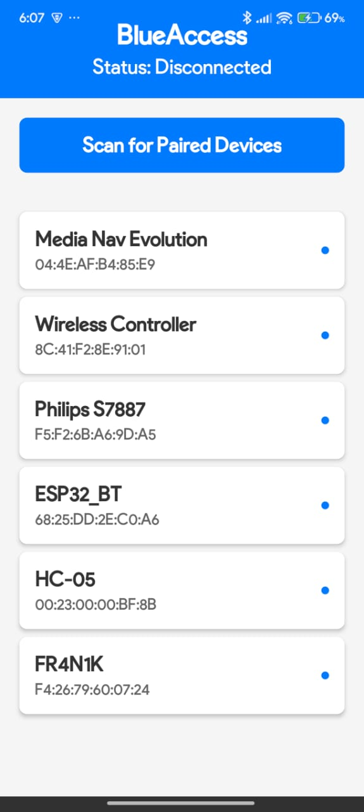
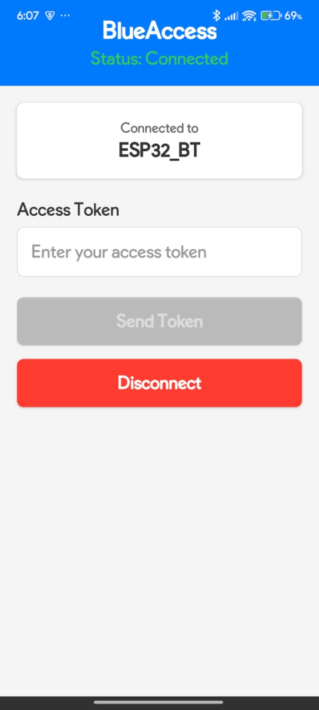
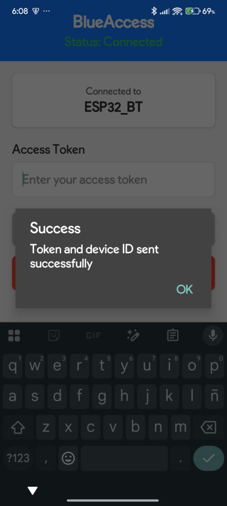

# BlueAccess


A secure, React Native mobile application for Bluetooth-based door access control. BlueAccess connects to Arduino-powered lock systems via HC-05 Bluetooth modules, enabling keyless entry with unique device identification and token-based authentication.

<p  align="center">   </p>

## ✨ Features

- **🔍 Device Discovery** : Scan and list paired Bluetooth devices
- **🔐 Secure Authentication** : Token-based access with unique device ID
- **📱 Real-time Status** : Live connection status monitoring
- **⚡ Fast Connection** : Quick pairing with HC-05 modules
- **🛡️ Permission Handling** : Automatic Android Bluetooth permission management
- **💾 Persistent ID** : Unique device identification stored locally
- **🎨 Clean UI** : Modern, intuitive interface with visual feedback

## 🛠️ Tech Stack

**Frontend:**

- React Native 0.72+
- TypeScript 5.0+
- React Hooks (Custom hooks pattern)

**Libraries:**

- `react-native-bluetooth-classic` - Bluetooth serial communication
- `@react-native-async-storage/async-storage` - Local data persistence
- `react-native-uuid` - Unique ID generation
- `react-native-safe-area-context` - Safe area handling

**Architecture:**

- Custom Hooks for business logic
- Service layer pattern
- Component-based architecture
- TypeScript for type safety

## 📂 Project Structure

```
src/
├── components/          # Reusable UI components
│   ├── Header.tsx
│   ├── DeviceList.tsx
│   ├── DeviceItem.tsx
│   └── ConnectionPanel.tsx
├── hooks/              # Custom React hooks
│   ├── useBluetooth.ts
│   ├── useDeviceId.ts
│   └── usePermissions.ts
├── services/           # Business logic services
│   ├── bluetoothService.ts
│   └── storageService.ts
├── styles/             # Design system
│   └── theme.ts
├── types/              # TypeScript type definitions
│   └── index.ts
└── App.tsx            # Main application component
```

## 🚀 Getting Started

### Prerequisites

- Node.js 18+ and npm/yarn
- React Native development environment setup
- Android Studio (for Android) or Xcode (for iOS)
- Physical Android device (Bluetooth doesn't work well on emulators)
- HC-05 Bluetooth module paired with your device

### Installation

1. Clone the repository:

```bash
git clone https://github.com/fr4n1k/BlueAccess.git
cd blueaccess
```

2. Install dependencies:

```bash
npm install
# or
yarn install
```

3. Install iOS pods (iOS only):

```bash
cd ios && pod install && cd ..
```

4. Run the app:

```bash
# Android
npm run android

# iOS
npm run ios
```

## 🔧 Configuration

### Android Permissions

The app automatically requests the following permissions on Android:

- `ACCESS_FINE_LOCATION` - Required for Bluetooth scanning
- `BLUETOOTH_SCAN` - Required for discovering devices
- `BLUETOOTH_CONNECT` - Required for connecting to devices

These are defined in `AndroidManifest.xml`:

```xml
<uses-permission android:name="android.permission.BLUETOOTH" />
<uses-permission android:name="android.permission.BLUETOOTH_ADMIN" />
<uses-permission android:name="android.permission.ACCESS_FINE_LOCATION" />
<uses-permission android:name="android.permission.BLUETOOTH_SCAN" />
<uses-permission android:name="android.permission.BLUETOOTH_CONNECT" />
```

### Arduino Setup

The app sends data in the format: `TOKEN|DEVICE_ID\n`

Example Arduino code to receive:

```cpp
void setup() {
  Serial.begin(9600);
}

void loop() {
  if (Serial.available()) {
    String data = Serial.readStringUntil('\n');
    // Parse token and device ID
    // data format: "mytoken123|uuid-here"
  }
}
```

## 💡 How It Works

1. **Permission Request** : App requests Bluetooth permissions on launch
2. **Device ID Generation** : Creates or retrieves unique device ID from storage
3. **Device Scanning** : User scans for paired Bluetooth devices
4. **Connection** : User selects a device from the list
5. **Token Entry** : User enters access token
6. **Data Transmission** : App sends `TOKEN|DEVICE_ID` to Arduino
7. **Door Control** : Arduino validates and triggers door mechanism

## 🏗️ Architecture Decisions

### Custom Hooks Pattern

Separated business logic into custom hooks (`useBluetooth`, `useDeviceId`, `usePermissions`) for better reusability and testability.

### Service Layer

Created dedicated services (`BluetoothService`, `StorageService`) to abstract external dependencies and make code more maintainable.

### TypeScript

Full TypeScript implementation ensures type safety and better developer experience with autocompletion and compile-time error checking.

### Component Composition

Small, focused components promote reusability and easier testing.

## 🐛 Troubleshooting

**Device not connecting:**

- Ensure Bluetooth is enabled on your phone
- Pair the HC-05 module in phone settings first
- Check if HC-05 is powered on (LED blinking)

**Permissions denied:**

- Go to Settings > Apps > BlueAccess > Permissions
- Enable Location and Bluetooth permissions

**Data not sending:**

- Verify HC-05 baud rate matches your Arduino (default: 9600)
- Check Arduino Serial Monitor for incoming data

## 🔮 Future Enhancements

- [ ] QR code scanning for token entry
- [ ] Multiple device support
- [ ] Access log history
- [ ] Biometric authentication
- [ ] Wi-Fi fallback connection
- [ ] Push notifications
- [ ] iOS support (using BLE)

## 🤝 Contributing

Contributions are welcome! Please feel free to submit a Pull Request.

## 📄 License

This project is licensed under the MIT License.

## 👤 Author

**Franco Bollati**

- Email: fran_bollati@hotmail.com
- LinkedIn: www.linkedin.com/in/franco-bollati-7390a917a
- GitHub: https://github.com/fr4n1k

## 🙏 Acknowledgments

- HC-05 Bluetooth Module community
- React Native Bluetooth Classic contributors
- Arduino community

---

⭐ If you find this project useful, please consider giving it a star!

Built with ❤️ using React Native and TypeScript
